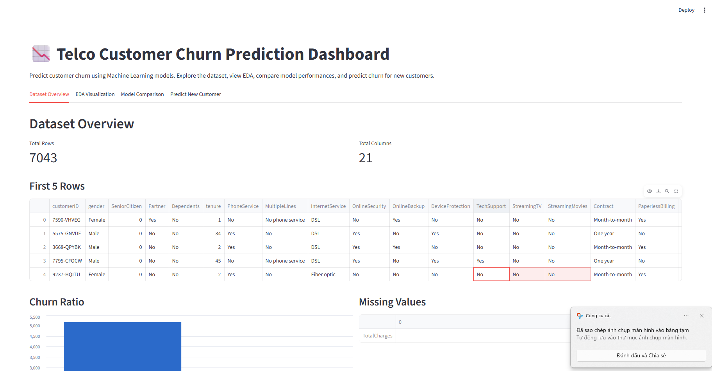
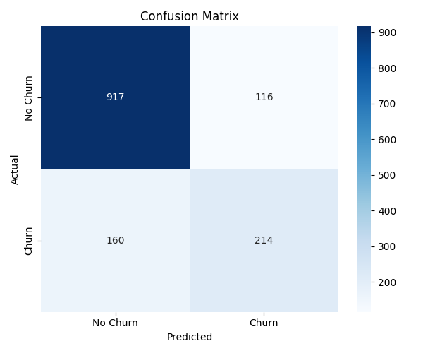
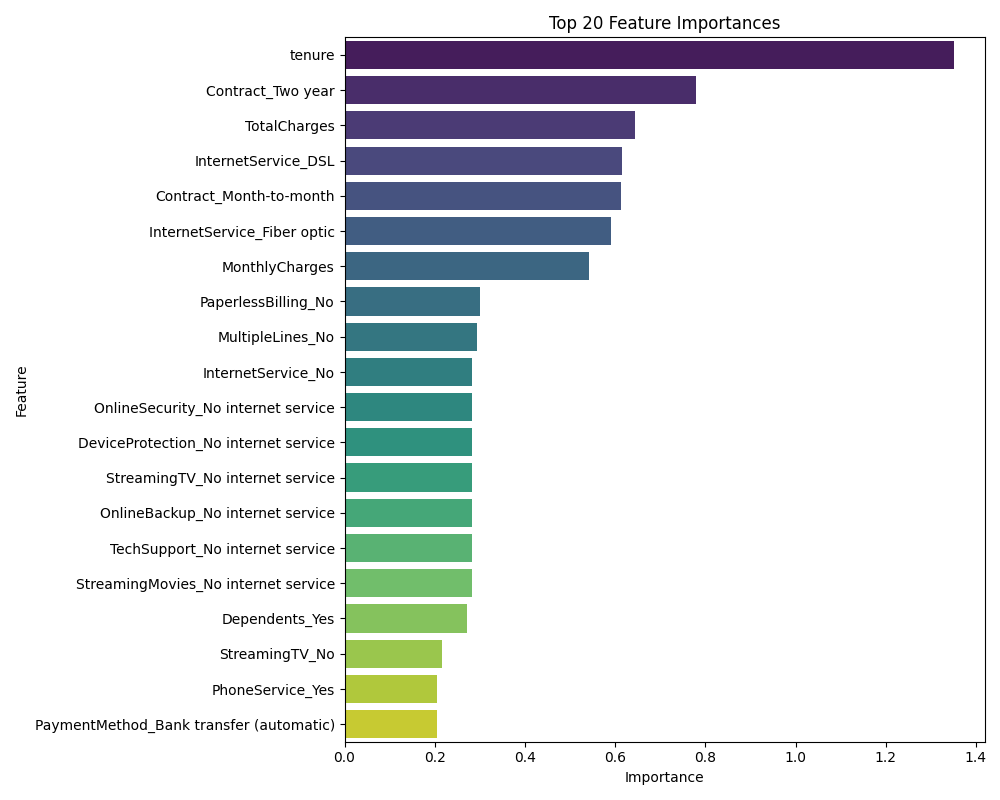
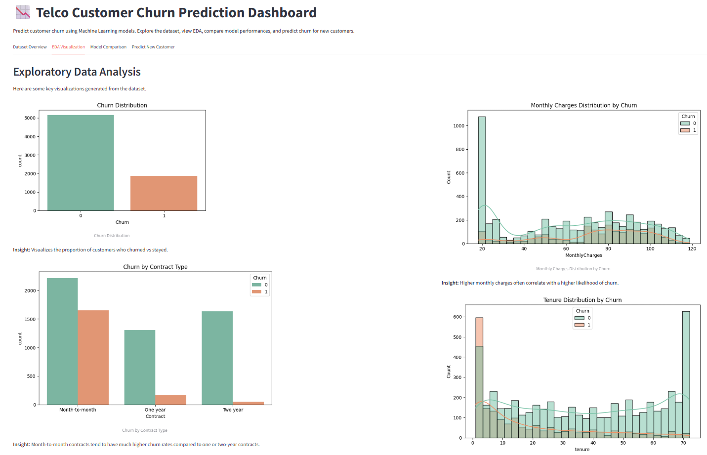
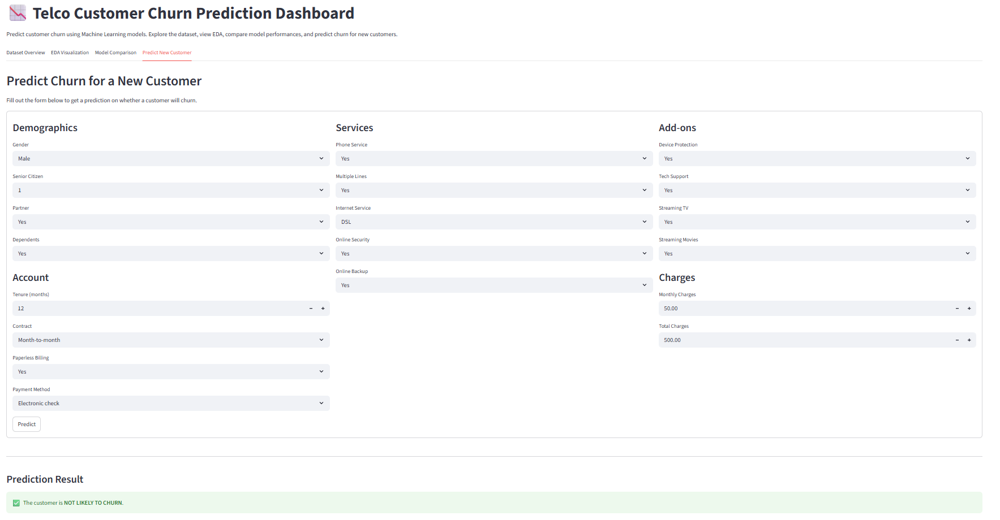

# Customer Churn Prediction Dashboard

 *(Note: Please replace with your actual screenshot)*

## Project Overview
This project is an end-to-end Machine Learning web application designed to predict customer churn using the Telco Customer Churn dataset. It features a complete pipeline from data processing to model evaluation, wrapped in an interactive Streamlit dashboard. 

Customer churn is a critical metric for telecommunications companies. By predicting which customers are at high risk of leaving, businesses can proactively offer targeted incentives to retain them, thereby reducing revenue loss.

## Project Workflow
1. **Data Collection & Cleaning**: Handled missing values, converted `TotalCharges` to numeric, and mapped target variables.
2. **Feature Engineering**: Split data into features/target, applied `OneHotEncoder` for categorical features, and `StandardScaler` for numeric features using scikit-learn's `ColumnTransformer`.
3. **Model Training**: Trained five diverse Machine Learning models (Logistic Regression, KNN, Decision Tree, Random Forest, SVM) using stratified train-test splits to prevent data leakage.
4. **Evaluation**: Evaluated models using Accuracy, Precision, Recall, F1-score, and ROC-AUC. F1-score and Recall were prioritized due to the imbalanced nature of churn prediction.
5. **Deployment**: Saved the best-performing complete `Pipeline` (preprocessing + classifier) using `joblib` and built an interactive web dashboard with Streamlit.

## Model Performance
The models were evaluated based on multiple metrics. **Logistic Regression** achieved the best balance of Recall and F1-score for identifying churned customers. 

*The detailed comparison table is generated automatically in `models/model_metrics.csv`.*

### Confusion Matrix


### Feature Importance


## Screenshots
*(Note: Create a folder named `screenshots` in `outputs/` and add your screenshots here)*

### 1. Dataset Overview & EDA


### 2. Real-time Churn Prediction


## Technologies Used
- **Python**: Core programming language.
- **Scikit-Learn**: Machine learning and preprocessing pipelines.
- **Pandas & NumPy**: Data manipulation and numerical operations.
- **Matplotlib & Seaborn**: Data visualization and EDA.
- **Streamlit**: Web application framework for the interactive dashboard.
- **Joblib**: Model serialization.

## How to Run (Local Setup)

1. **Clone the repository**
   ```bash
   git clone https://github.com/your-username/customer-churn-prediction.git
   cd customer-churn-prediction
   ```

2. **Set up the dataset**
   Download the [Telco Customer Churn dataset from Kaggle](https://www.kaggle.com/datasets/blastchar/telco-customer-churn).
   Place the downloaded `WA_Fn-UseC_-Telco-Customer-Churn.csv` file inside the `data/` folder and rename it to `telco_customer_churn.csv`.

3. **Install dependencies**
   ```bash
   pip install -r requirements.txt
   ```

4. **Train the models**
   Run the training script to build the models and generate evaluation metrics:
   ```bash
   python src/train_model.py
   ```

5. **Run the Streamlit Dashboard**
   Launch the interactive web app:
   ```bash
   streamlit run app.py
   ```
   Open the provided local URL (usually `http://localhost:8501`) in your browser.

## Future Improvements
- **Hyperparameter Tuning**: Implement `GridSearchCV` or `RandomizedSearchCV` to optimize model parameters.
- **Advanced Models**: Integrate gradient boosting algorithms like XGBoost or LightGBM.
- **Explainable AI**: Add SHAP (SHapley Additive exPlanations) values to the dashboard to explain why a specific prediction was made.
- **Dockerization**: Containerize the application using Docker to ensure consistent deployment across environments.
